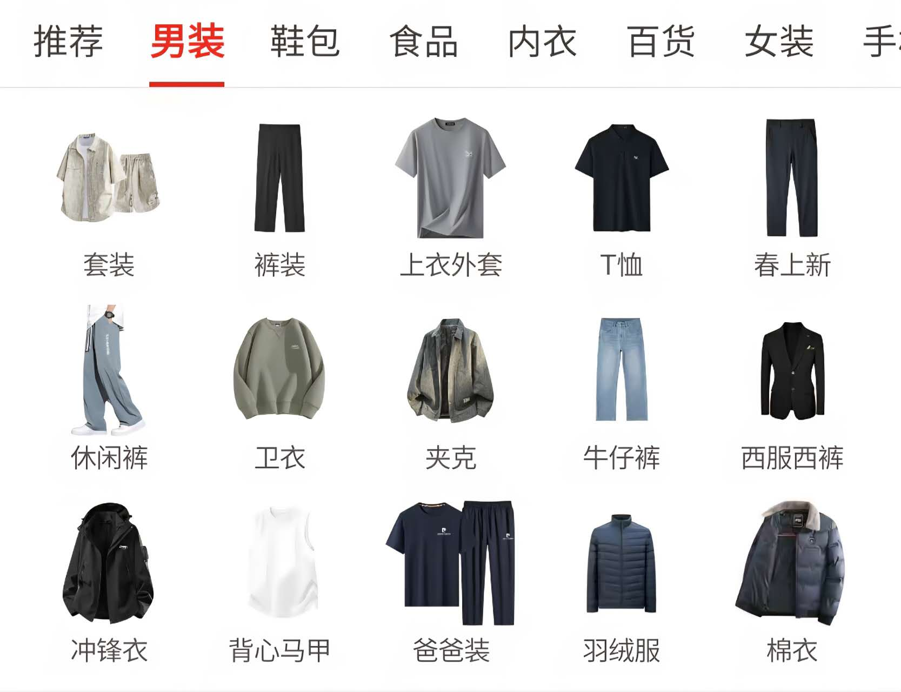

# 平多多 - Section vêtements

| Caractère | Pinyin | Traduction |
| :--- | :--- | :--- |
| 推荐 | tuījiàn | recommander |
| 男装 | nánzhuāng | vêtements hommes |
| 鞋包 | xiébāo | chaussures et sacs |
| 食品 | shípǐn | alimentation |
| 内衣 | nèiyī | sous-vêtements |
| 百货 | bǎihuò | articles divers / grand magasin |
| 女装 | nǚzhuāng | vêtements femmes |
| 套装 | tàozhuāng | ensemble / tailleur |
| 裤装 | kùzhuāng | pantalons |
| 上衣外套 | shàngyī wàitào | hauts et manteaux |
| T恤 | T xù | T-shirt |
| 春上新 | chūn shàngxīn | nouveaux arrivages printemps |
| 休闲裤 | xiūxiánkù | pantalon décontracté |
| 卫衣 | wèiyī | sweat-shirt |
| 夹克 | jiákè | veste |
| 牛仔裤 | niúzǎikù | jean |
| 西服西裤 | xīfú xīkù | costume et pantalon de costume |
| 冲锋衣 | chōngfēngyī | veste imperméable / coupe-vent |
| 背心马甲 | bèixīn mǎjiǎ | débardeur / gilet |
| 爸爸装 | bàba zhuāng | vêtements pour père |
| 羽绒服 | yǔróngfú | doudoune |
| 棉衣 | miányī | veste matelassée / doudoune en coton |

## Grammaire

**1. 想 + verbe : vouloir / avoir envie de**

- 我想买一件**卫衣**。 (Je veux acheter un sweat-shirt.)
- 你想看**男装**还是**女装**？ (Tu veux voir les vêtements hommes ou femmes ?)

**2. 有 + nom : avoir / il y a**

- 这个店有**牛仔裤**和**夹克**。 (Ce magasin a des jeans et des vestes.)
- **春上新**有很多**休闲裤**。 (Les nouveaux arrivages printemps ont beaucoup de pantalons décontractés.)

**3. 比较 + adjectif : relativement / assez**

- **羽绒服**比较贵。 (Les doudounes sont assez chères.)
- **T恤**比较便宜。 (Les T-shirts sont relativement bon marché.)

## Mise en pratique

**Dialogue :**

A : 你好！我想买**爸爸装**，有什么**推荐**吗？
B： 有**夹克**和**棉衣**，都比较暖和。
A： 有没有**西服西裤**？
B： 有，在**男装**区。

**Phrases d'exemple :**

- 我在**百货**买**鞋包**和**内衣**。
- **冲锋衣**适合春天和秋天穿。
- 这个**套装**很好看，我想试试。
- **春上新**的**卫衣**和**牛仔裤**很受欢迎。
- 天冷了，我需要买一件**羽绒服**。