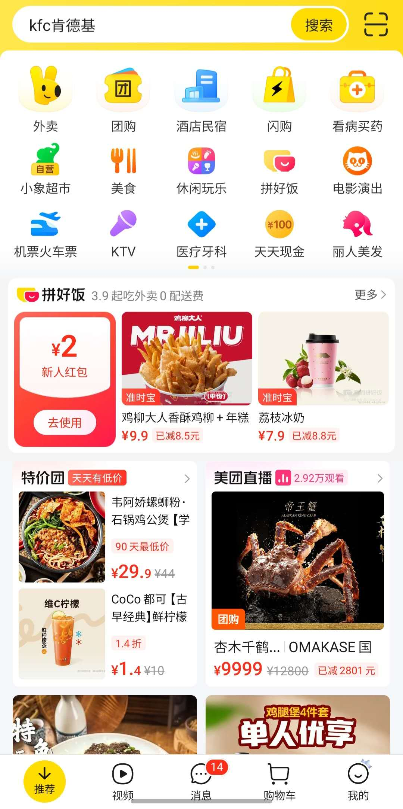

# 美团 - Page d'accueil

| Caractère | Pinyin | Traduction |
| :--- | :--- | :--- |
| 外卖 | wàimài | Livraison de repas |
| 团购 | tuángòu | Achat groupé |
| 酒店 | jiǔdiàn | Hôtel |
| 民宿 | mínshù | Chambre d'hôte / Airbnb |
| 闪购 | shǎngòu | Vente flash |
| 看病 | kànbìng | Voir un médecin |
| 买药 | mǎiyào | Acheter des médicaments |
| 美食 | měishí | Gastronomie / Cuisine délicieuse |
| 休闲玩乐 | xiūxián wánlè | Loisirs et divertissements |
| 电影 | diànyǐng | Cinéma |
| 演出 | yǎnchū | Spectacle / Performance |
| 机票 | jīpiào | Billet d'avion |
| 火车票 | huǒchēpiào | Billet de train |
| 医疗 | yīliáo | Médical / Soins de santé |
| 美发 | měifà | Coiffure |
| 现金 | xiànjīn | Argent liquide |
| 红包 | hóngbāo | Enveloppe rouge (coupon/bonus) |
| 特价 | tèjià | Prix spécial / Promo |
| 直播 | zhíbō | Diffusion en direct (Livestream) |
| 购物车 | gòuwùchē | Panier d'achat |

## Grammaire

### 1. L'utilisation de "去" (qù) pour l'action
Sur l'interface, on voit **去使用** (Aller pour utiliser). En mandarin, "去 + Verbe" indique l'intention de réaliser une action.
* **去吃饭** (qù chīfàn) : Aller manger.
* **去买药** (qù mǎiyào) : Aller acheter des médicaments.

### 2. La structure de réduction "已减" (yǐ jiǎn)
Utilisée pour indiquer le montant déjà déduit du prix original.
* **已减 8.5 元** (yǐ jiǎn bā diǎn wǔ yuán) : 8,5 yuans déjà déduits.
* **Structure :** [Prix final] + 已减 + [Montant de la réduction].

## Mise en pratique

### Dialogue : Commander à manger
**A:** 你饿吗？我们要不要点**外卖**？
*(Nǐ è ma? Wǒmen yào bùyào diǎn wàimài?)*
Tu as faim ? Est-ce qu'on commande à domicile ?

**B:** 好啊, 我看看美团。这张**红包**可以**去使用**吗？
*(Hǎo a, wǒ kànkan Měituán. Zhè zhāng hóngbāo kěyǐ qù shǐyòng ma?)*
D'accord, je regarde Meituan. Est-ce que je peux utiliser ce coupon "enveloppe rouge" ?

**A:** 可以，而且现在有**特价**，**已减**十块钱。
*(Kěyǐ, érqiě xiànzài yǒu tèjià, yǐ jiǎn shí kuài qián.)*
Oui, et en plus il y a un prix spécial en ce moment, dix yuans sont déjà déduits.

### Monologue : Organiser son week-end
我打算周末出去玩。先在网上订**机票**和**酒店**。如果有时间，我还想去中心看一场**电影**或者去唱歌 **KTV**。
*(Wǒ dǎsuàn zhōumò chūqù wán. Xiān zài wǎngshàng dìng jīpiào hé jiǔdiàn. Rúguǒ yǒu shíjiān, wǒ hái xiǎng qù zhōngxīn kàn yī chǎng diànyǐng huòzhě qù chànggē KTV.)*
Je prévois de sortir ce week-end. D'abord, je réserve un billet d'avion et un hôtel en ligne. Si j'ai le temps, je veux aussi aller en centre-ville voir un film ou aller au KTV.