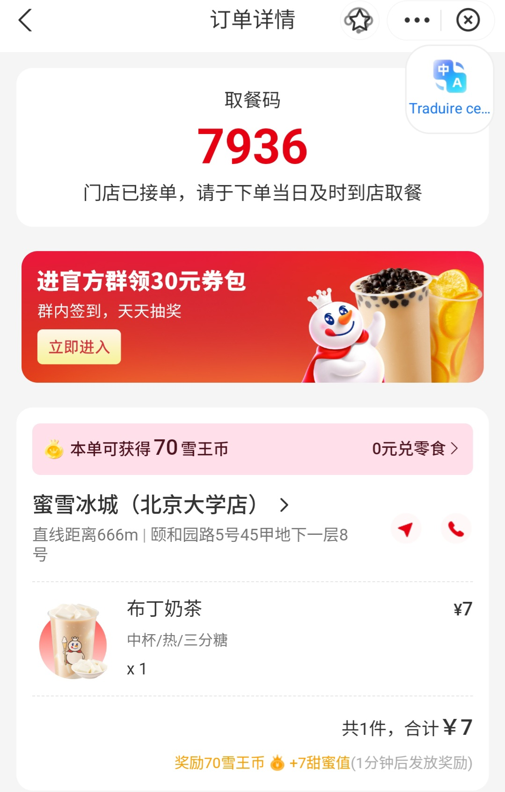

# Commander un thé au lait et gérer ses récompenses (Mixue)

| Caractère | Pinyin | Traduction |
| :--- | :--- | :--- |
| 订单详情 | dìngdān xiángqíng | Détails de la commande |
| 取餐码 | qǔcānmǎ | Code de retrait |
| 门店已接单 | méndiàn yǐ jiēdān | Le magasin a accepté la commande |
| 进官方群 | jìn guānfāng qún | Rejoindre le groupe officiel |
| 领30元券包 | lǐng sānshí yuán quàn bāo | Recevoir un pack de coupons de 30¥ |
| 群内签到 | qún nèi qiāndào | Pointer/S'enregistrer dans le groupe |
| 天天抽奖 | tiāntiān chōujiǎng | Tirage au sort quotidien |
| 立即进入 | lìjí jìnrù | Entrer immédiatement |
| 本单可获得 | běn dān kě huòdé | Cette commande permet d'obtenir |
| 雪王币 | xuěwáng bì | Pièces "Roi des Neiges" (points fidélité) |
| 0元兑零食 | líng yuán duì língshí | Échanger contre des snacks pour 0¥ |
| 甜蜜值 | tiánmì zhí | Valeur de "sucrosité" (score de fidélité) |
| 发放奖励 | fāfàng jiǎnglì | Distribution des récompenses |

## Grammaire

### 1. L'obtention avec "获得" (huòdé) et "领" (lǐng)
* **获得** est utilisé pour un gain suite à une action (achat, effort).
* **领** (ou **领取** lǐngqǔ) est utilisé pour "récupérer" ou "collecter" un cadeau ou un coupon gratuit.
* **Exemple :** 本单可**获得**70雪王币。(Běn dān kě huòdé qīshí xuěwáng bì.) - Cette commande permet d'obtenir 70 pièces.
* **Exemple :** 记得去**领**优惠券。(Jìde qù lǐng yōuhuìquàn.) - N'oublie pas d'aller récupérer les coupons de réduction.

### 2. L'échange avec "兑" (duì)
Abréviation de **兑换** (duìhuàn), ce terme exprime l'action de troquer des points contre un produit.
* **Structure :** [Points/Prix] + 兑 + [Objet]
* **Exemple :** **0元兑**零食。(Líng yuán duì língshí.) - Échanger contre des snacks pour 0 yuan.
* **Exemple :** 用积分**兑**一杯奶茶。(Yòng jīfèn duì yī bēi nǎichá.) - Utiliser des points pour échanger contre un thé au lait.

## Mise en pratique

### Dialogue : Rejoindre le programme de fidélité
**Client :** 怎么领这30块钱的优惠券？ (Zěnme lǐng zhè sānshí kuài qián de yōuhuìquàn?)
*Comment récupérer ce pack de coupons de 30 yuans ?*

**Vendeur :** 你需要进我们的官方群，天天还可以抽奖。 (Nǐ xūyào jìn wǒmen de guānfāng qún, tiāntiān hái kěyǐ chōujiǎng.)
*Vous devez rejoindre notre groupe officiel, vous pourrez aussi participer à un tirage au sort chaque jour.*

**Client :** 好的。那雪王币有什么用？ (Hǎode. Nà xuěwáng bì yǒu shéme yòng?)
*D'accord. À quoi servent les pièces 雪王 (Xuéwáng) ?*

**Vendeur :** 攒够了可以兑换零食或者饮料。 (Zǎn gòule kěyǐ duìhuàn língshí huòzhě yǐnliào.)
*Une fois que vous en avez assez épargné, vous pouvez les échanger contre des snacks ou des boissons.*

### Monologue : Vérification de l'application
这张订单除了奶茶，还给了我70个雪王币和7点甜蜜值。奖励会在一分钟后发放。如果我进群签到，还能领更多奖励。
(Zhè zhāng dìngdān chúle nǎichá, hái gěile wǒ qīshí gè xuěwáng bì hé qī diǎn tiánmì zhí. Jiǎnglì huì zài yī fēnzhōng hòu fāfàng. Rúguǒ wǒ jìn qún qiāndào, hái néng lǐng gèng duō jiǎnglì.)
*Cette commande, en plus du thé au lait, m'a rapporté 70 pièces et 7 points de fidélité. Les récompenses seront distribuées dans une minute. Si je rejoins le groupe pour pointer, je pourrai collecter encore plus de récompenses.*