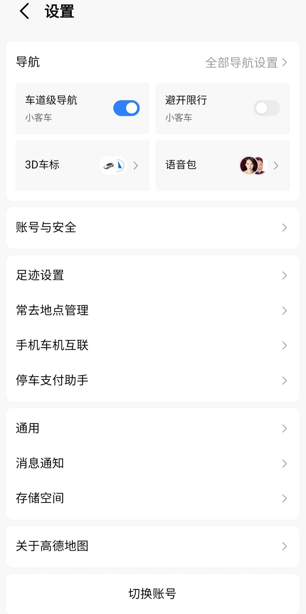

# Les paramètres d'une application de navigation

| Caractère | Pinyin | Traduction |
| :--- | :--- | :--- |
| 设置 | shè zhì | Paramètres / Configurer |
| 导航 | dǎo háng | Navigation / Naviguer |
| 全部 | quán bù | Tout / Entier |
| 车道级 | chē dào jí | Au niveau de la voie |
| 小客车 | xiǎo kè chē | Voiture de tourisme (véhicule léger) |
| 避开 | bì kāi | Éviter / Contourner |
| 限行 | xiàn xíng | Restriction de circulation |
| 车标 | chē biāo | Icône/Logo du véhicule |
| 语音包 | yǔ yīn bāo | Pack vocal |
| 账号 | zhàng hào | Compte (utilisateur) |
| 与 | yǔ | Et (formel) |
| 安全 | ān quán | Sécurité |
| 足迹 | zú jì | Empreintes / Historique des trajets |
| 常去 | cháng qù | Fréquemment visité |
| 地点 | dì diǎn | Lieu / Endroit |
| 管理 | guǎn lǐ | Gestion / Gérer |
| 手机 | shǒu jī | Téléphone portable |
| 车机 | chē jī | Écran embarqué (voiture) |
| 互联 | hù lián | Interconnexion |
| 停车 | tíng chē | Se garer / Stationnement |
| 支付 | zhī fù | Paiement / Payer |
| 助手 | zhù shǒu | Assistant |
| 通用 | tōng yòng | Général / Paramètres généraux |
| 消息 | xiāo xī | Message |
| 通知 | tōng zhī | Notification |
| 存储空间 | cún chǔ kōng jiān | Espace de stockage |
| 关于 | guān yú | À propos de |
| 高德地图 | gāo dé dì tú | Amap (Application de cartographie) |
| 切换 | qiē huàn | Basculer / Changer |

## Grammaire

**1. L'utilisation de 与 (yǔ) pour exprimer "et"**
Dans le langage écrit ou formel (comme les menus d'applications), "与" remplace souvent "和" (hé) pour relier deux noms.
* 账号与安全 (zhàng hào yǔ ān quán) : Compte et sécurité.
* 手机与电脑 (shǒu jī yǔ diàn nǎo) : Téléphone et ordinateur.

**2. Le verbe composé 避开 (bì kāi) pour l'évitement**
La structure [Verbe d'action] + 开 indique souvent la séparation ou l'éloignement d'un obstacle.
* 导航会帮你避开拥堵路段。 (Dǎo háng huì bāng nǐ bì kāi yōng dǔ lù duàn.)
    * La navigation t'aidera à éviter les routes embouteillées.
* 请避开限行区域。 (Qǐng bì kāi xiàn xíng qū yù.)
    * Veuillez éviter les zones à circulation restreinte.

**3. L'utilisation de 关于 (guān yú) pour "à propos de"**
Placé en début de phrase ou avant un nom pour introduire le sujet dont on parle.
* 关于高德地图 (guān yú gāo dé dì tú) : À propos de Amap.
* 我有一个关于支付的问题。 (Wǒ yǒu yí ge guān yú zhī fù de wèn tí.)
    * J'ai une question concernant le paiement.

## Mise en pratique

**Phrases utiles avec l'interface :**

* **A:** 我想换一个导航声音。在哪儿设置？ 
    * (Wǒ xiǎng huàn yí ge dǎo háng shēng yīn. Zài nǎ'er shè zhì?)
    * Je veux changer la voix de la navigation. Où est-ce que ça se configure ?
* **B:** 你可以去“设置”，然后下载一个新的**语音包**。
    * (Nǐ kě yǐ qù “shè zhì”, rán hòu xià zài yí ge xīn de yǔ yīn bāo.)
    * Tu peux aller dans "Paramètres", puis télécharger un nouveau pack vocal.

**Dialogue court - Gestion du compte :**

* **A:** 这个手机怎么**切换账号**？
    * (Zhè ge shǒu jī zěn me qiē huàn zhàng hào?)
    * Comment on change de compte sur ce téléphone ?
* **B:** 在最下面。你需要先进入**账号与安全**。
    * (Zài zuì xià miàn. Nǐ xū yào xiān jìn rù zhàng hào yǔ ān quán.)
    * C'est tout en bas. Tu dois d'abord entrer dans "Compte et sécurité".

**Monologue - Configuration avant le départ :**

开车前，我习惯打开**高德地图**。在**导航**设置里，我会打开“**避开限行**”，这样就不会被罚款。我也会检查一下**消息通知**。
*(Kāi chē qián, wǒ xí guàn dǎ kāi gāo dé dì tú. Zài dǎo háng shè zhì lǐ, wǒ huì dǎ kāi “bì kāi xiàn xíng”, zhè yàng jiù bú huì bèi fá kuǎn. Wǒ yě huì jiǎn chá yí xià xiāo xī tōng zhī.)*
Avant de conduire, j'ai l'habitude d'ouvrir Amap. Dans les paramètres de navigation, j'active "Éviter les restrictions de circulation", comme ça je n'aurai pas d'amende. Je vérifie aussi les notifications de messages.