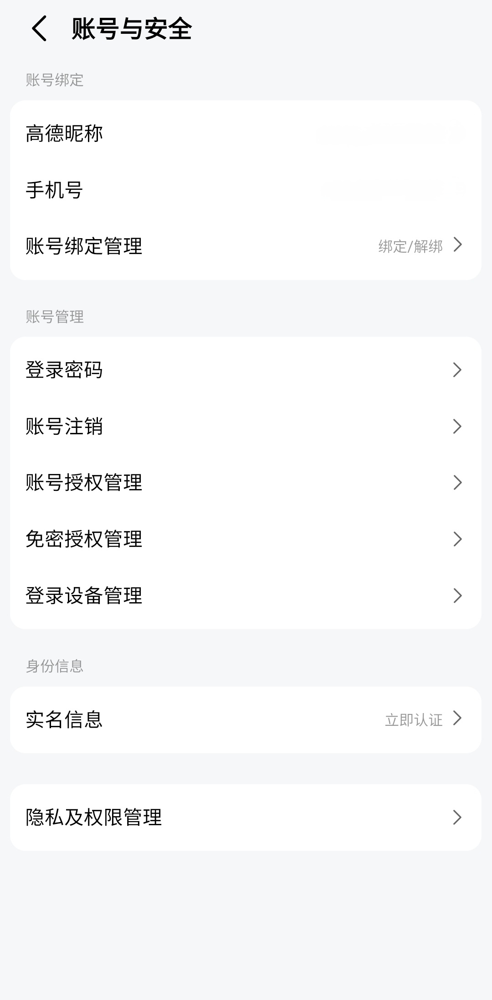

# Paramètres de Compte et Sécurité (Amap)

| Caractère | Pinyin | Traduction |
| :--- | :--- | :--- |
| 账号与安全 | zhànghào yǔ ānquán | Compte et sécurité |
| 高德昵称 | Gāodé nìchēng | Pseudonyme Amap |
| 手机号 | shǒujī hào | Numéro de téléphone |
| 账号绑定管理 | zhànghào bǎngdìng guǎnlǐ | Gestion des comptes liés |
| 绑定/解绑 | bǎngdìng / jiěbǎng | Lier / Délier |
| 登录密码 | dēnglù mìmǎ | Mot de passe de connexion |
| 账号注销 | zhànghào zhùxiāo | Supprimer le compte |
| 账号授权管理 | zhànghào shòuquán guǎnlǐ | Gestion des autorisations du compte |
| 免密授权管理 | miǎnmì shòuquán guǎnlǐ | Gestion des paiements sans mot de passe |
| 登录设备管理 | dēnglù shèbèi guǎnlǐ | Gestion des appareils connectés |
| 实名信息 | shímíng xìnxī | Informations d'identité réelle |
| 立即认证 | lìjí rènzhèng | Authentifier maintenant |
| 隐私及权限管理 | yǐnsī jí quánxián guǎnlǐ | Gestion de la confidentialité et des permissions |

## Grammaire

### 1. L'usage de 与 (yǔ)
Dans un contexte formel ou informatique, **与** est utilisé pour coordonner deux noms, fonctionnant comme "et".
* **账号与安全** (zhànghào yǔ ānquán) : Compte et sécurité.
* **隐私与权限** (yǐnsī yǔ quánxián) : Confidentialité et permissions.

### 2. Le suffixe 管理 (guǎnlǐ)
Placé après un nom, **管理** transforme le groupe nominal en "Gestion de [nom]".
* **设备管理** (shèbèi guǎnlǐ) : Gestion des appareils.
* **授权管理** (shòuquán guǎnlǐ) : Gestion des autorisations.

### 3. L'action immédiate avec 立即 (lìjí)
Cet adverbe se place avant le verbe pour indiquer une action à faire tout de suite.
* **立即认证** (lìjí rènzhèng) : S'authentifier immédiatement.
* **立即绑定** (lìjí bǎngdìng) : Lier immédiatement.

## Mise en pratique

* **我想修改我的登录密码。**
    * *Wǒ xiǎng xiūgǎi wǒ de dēnglù mìmǎ.*
    * Je voudrais modifier mon mot de passe de connexion.

* **如何在这儿解绑手机号？**
    * *Rúhé zài zhèr jiěbǎng shǒujī hào?*
    * Comment délier le numéro de téléphone ici ?

* **去实名信息中心，点击“立即认证”。**
    * *Qù shímíng xìnxī zhōngxīn, diǎnjī “lìjí rènzhèng”.*
    * Allez dans le centre d'informations d'identité réelle et cliquez sur "Authentifier maintenant".

* **我想注销我的高德账号。**
    * *Wǒ xiǎng zhùxiāo wǒ de Gāodé zhànghào.*
    * Je souhaite supprimer mon compte Amap.